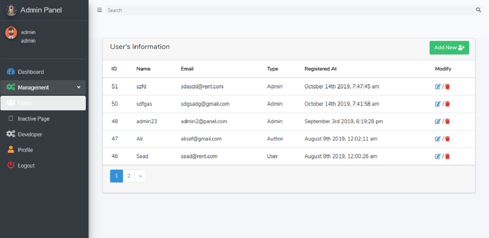

# AdminPanel
AdminLTE3 with Laravel 5.8 and Vuejs 2.9.6

# About Project
Admin panel For Laravel backend api's and Vuejs components as frontend . This repo is based on practical web application development. You can also costumize it and use it according to your need.
 
 
 
				                    Admin Panel Dashboard

 
 
				    	            Admin Panel Users's  Table

 
				                    Admin Panel Add User's Modal

 
 
				                    Admin Panel Profile's 

# Description

    Here are the things implemented in this project:

    ⦁   Use of Vue Router with Laravel
    ⦁   AdminLTE 3
    ⦁   Font Awesome 5 on Laravel
    ⦁	Use of SweetAlert for alert notification 
    ⦁	Use of API in Laravel
    ⦁	Api Auth with Laravel Passport
    ⦁	JWT with Laravel Passport and JavaScript Request
    ⦁	Vue Custom Events
    ⦁	Vue form with Laravel
    ⦁	Relational Database with Laravel
    ⦁	Axios and Ajax Request
    ⦁	ACL in Laravel
    ⦁	And much more...

# Installation

    ⦁   Clone the repo git clone https://github.com/Abdullah22safdar/AdminPanel
    ⦁	cd to project folder.
    ⦁	Run composer install
    ⦁	Save as the .env.example to .env and set your database information
    ⦁	Run php artisan key:generate to generate the app key
    ⦁	Run npm install
    ⦁	Run php artisan migrate
    ⦁	Done !!! Enjoy Customizing and building your app
